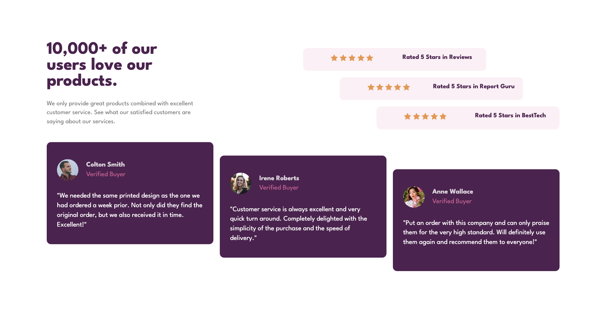

# Frontend Mentor - Social proof section solution

This is a solution to the [Social proof section challenge on Frontend Mentor](https://www.frontendmentor.io/challenges/social-proof-section-6e0qTv_bA). Frontend Mentor challenges help you improve your coding skills by building realistic projects. 

## Table of contents

- [Overview](#overview)
  - [The challenge](#the-challenge)
  - [Screenshot](#screenshot)
  - [Links](#links)
- [My process](#my-process)
  - [Built with](#built-with)
  - [What I learned](#what-i-learned)
  - [Continued development](#continued-development)
- [Author](#author)


## Overview

### The challenge

Users should be able to:

- View the optimal layout for the section depending on their device's screen size

### Screenshot




### Links

- Solution URL: [Solution URL](https://github.com/Kamania/social-proof-section-master)
- Live Site URL: [Live site URL](https://social-proof-section-master-pink-alpha.vercel.app/)

## My process

### Built with

- Semantic HTML5 markup
- CSS custom properties
- Flexbox
- CSS Grid
- Mobile-first workflow

### What I learned

I deepened my understanding of CSS GRID

```html
<section class="rate-section">
  <div class="rate-card rate-card1">
    <div class="star-rate">
      
      
      
      
      
    </div>
    <span class="rate-card-description">Rated 5 Stars in Reviews</span>
  </div>
  <div class="rate-card rate-card2">
    <div class="star-rate">
      
      
      
      
      
    </div>
    <span class="rate-card-description">Rated 5 Stars in Report Guru</span>
  </div>
  <div class="rate-card rate-card3">
    <div class="star-rate">
      
      
      
      
      
    </div>
    <span class="rate-card-description">Rated 5 Stars in BestTech</span>
  </div>
</section>
```
```css
.rate-section{
  display: grid;
  grid-template-columns: repeat(7, 1fr);
}

.rate-card{
  display: grid;
  grid-template-columns: 1fr 1fr;
  justify-items: center;
}

.rate-card1{
  grid-column: 1/6;
}

.rate-card2{
  grid-column: 2/7;
}

.rate-card3{
  grid-column: 3/8;
}
```

### Continued development

I'll be implementing the project using Bootstrap 5

## Author

- Frontend Mentor - [@Kamania](https://www.frontendmentor.io/profile/Kamania)
- Twitter - [@Josephkamania](https://twitter.com/Josephkamania)


